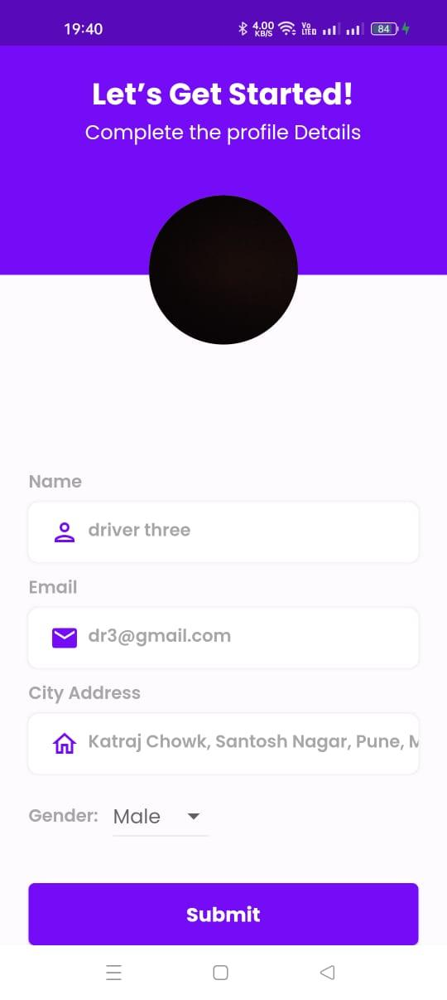

# Stop-based ride-sharing app

This is a ride-sharing application creates using flutter, firebase and google map. Drivers select source and destination points from pre-istablished points on the map to creating ride. Passengers can browse rides from a points, rides between two points. The can also see rides between points near to specified points. Passengers can send request to join rides which get apporved(or rejectet) by driver. All other facilities like checking upcoming, ongoging and past rides, managing requests, getting support for rides, ride notification are provides. In this version stops are bus stops.   

Advantages of stop-based approach  
1) More rides between popular points than two arbitrary points
2) Can complete jounery in steps
3) More public transport options are available in case of cancellations
4) Drivers don't have to go out of there way to get passenger and can do it on their normla route
5) Extention to public transport

## Running the project
### Create firebase account and project 

### Initialize firebase project
Install and login to firebase cli (https://firebase.google.com/docs/cli)
Initalize fire project : 
1) run: dart pub global activate flutterfire_cli 
2) run: flutterfire configure 
or follow the guide - https://firebase.flutter.dev/docs/cli/ 

This will create the lib/firebase_options.dart file

### From firebase console get google-services.json file
 replace the android/app/google-serives.json file with your file

### get your google api key  
Replace 'GOOGLE_API_KEY' with the key 
1) android/app/src/main/AndroidManifest.xml
2) Web/index.html
3) lib/utils/api_constants

### google map platform 
create account on google map platform, enable map support for your project.

### install packages and run app 
dart pub get  
flutter run

## Screenshots

|   |  |
| ------------- | ------------- |
|  |   |
|   |  |

### Driver Side
|   |  |
| ------------- | ------------- |
|  |   |
|   |   |
|   |   |

### Passenger Side
|   |  |
| ------------- | ------------- |
|  |   |
|   |   |

<!-- ### to ignore changes of files containing your apis
git update-index --assume-unchanged android/app/src/main/AndroidManifest.xml 
git update-index --assume-unchanged android/app/google-services.json 
git update-index --assume-unchanged web/index.html 
git update-index --assume-unchanged lib/utils/api_constant.dart  -->